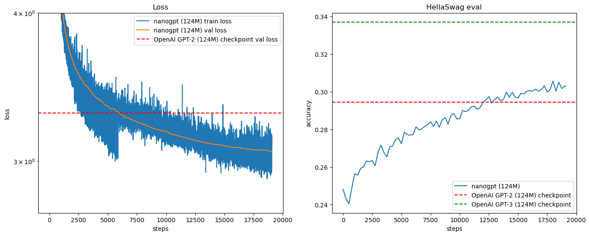

# GPT2-colab
This repo is to reproduce GPT2 on google colab using [karpathy/build-nanogpt](https://github.com/karpathy/build-nanogpt) code. For people who do not have strong gpus at home, this may provide a convenient to train your own gpt2 easily using 10BT fineweb-edu dataset.
## Settings
GPU used in colab is A100 40G.

Batch size is set to 32 to fit in the VRAM. Take about 39G in training, 
## Time Consumption
Colab pro+ is required as the total running time is above 20 hours for one epoch, consuming about 245 compute units. The official colab document says a session can last up to 24 hours for pro+ users, so you can start running, shutdown the broswer and come back after 20 hours to check the results.

Dataset downloading and sharding takes about 50 mins. One step training takes about 3.5s, total step is 19072, so total training time is about 3.5*19072/3600 = 18.54 hours. There are in training evaluation which would add extra time.

## Result
The result is similiar to what we saw in Karpathy's Youtube video. 

log.txt is the log file generated during training.